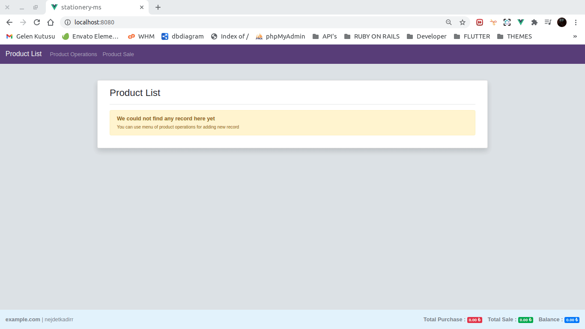

# stationery-ms
This application created with VueJS for learning it. 
This application is using
-   [Firebase](https://firebase.google.com/)
-   [Vuex](https://github.com/vuejs/vuex)
-   [Axios](https://github.com/axios/axios)



## Project setup
```
npm install
```

### Environment variables
Create a file named ".env.local" in the root directory and fill its contents as follows.
```ruby
VUE_APP_FIREBASE_DATABASE_URL = XXX
```

### Compiles and hot-reloads for development
```
npm run serve
```

### Compiles and minifies for production
```
npm run build
```

### Lints and fixes files
```
npm run lint
```

### Customize configuration
See [Configuration Reference](https://cli.vuejs.org/config/).

## LICENSE
```
MIT License

Copyright (c) 2020 Nejdet Kadir Bektaş

Permission is hereby granted, free of charge, to any person obtaining a copy
of this software and associated documentation files (the "Software"), to deal
in the Software without restriction, including without limitation the rights
to use, copy, modify, merge, publish, distribute, sublicense, and/or sell
copies of the Software, and to permit persons to whom the Software is
furnished to do so, subject to the following conditions:

The above copyright notice and this permission notice shall be included in all
copies or substantial portions of the Software.

THE SOFTWARE IS PROVIDED "AS IS", WITHOUT WARRANTY OF ANY KIND, EXPRESS OR
IMPLIED, INCLUDING BUT NOT LIMITED TO THE WARRANTIES OF MERCHANTABILITY,
FITNESS FOR A PARTICULAR PURPOSE AND NONINFRINGEMENT. IN NO EVENT SHALL THE
AUTHORS OR COPYRIGHT HOLDERS BE LIABLE FOR ANY CLAIM, DAMAGES OR OTHER
LIABILITY, WHETHER IN AN ACTION OF CONTRACT, TORT OR OTHERWISE, ARISING FROM,
OUT OF OR IN CONNECTION WITH THE SOFTWARE OR THE USE OR OTHER DEALINGS IN THE
SOFTWARE.

```

### NOTE 
The founding father of this game is [Gökhan Kandemir](https://www.youtube.com/channel/UCYT5QTr38bwp85Pka8YSVIg). This application created for learning VueJS with [his course](https://www.udemy.com/course/sifirdan-ileri-seviye-vuejs-2-vuex-vue-router-egitim-seti/) from [Udemy](https://www.udemy.com/).
